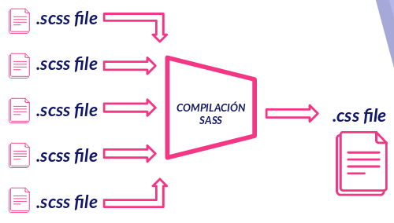

## Parte II.4  Compilando archivos 

En el apartado anterior vimos que compilar archivos Sass consiste en la generación de manera automática del CSS correspondiente.



En este apartado vamos a profundizar más en este proceso y vamos a ver que podemos realizar distintos tipos de compilación según nuestras necesidad.

### Tipos de compilación

A la hora de compilar tenemos muchas opciones pero para simplificar vamos a distinguir únicamente las siguientes:

* **Compilación simple:** donde a partir de un único fichero Sass generaremos un fichero CSS
* **Compilación múltiple:** donde partiendo de varios ficheros .scss podremos generar varios ficheros CSS
* **Compilación extendida:**  es la opción por defecto, se genera un regla CSS  por cada línea. Es la opción que se suele usar mientras estamos en fase de desarrollo.
* **Compilación comprimida:** generando una versión minimizada que elimina cualquier carácter que no sea imprescindible. Es la opción preferida una vez ya hemos pasado la fase de desarrollo y queremos subir nuestro CSS generado a producción.
*  **Compilación que vigila los cambios :** Es una opción que le pasamos al compilador Sass para que al producirse los cambios en los archivos Scss se vayan regenerando automáticamente los ficheros CSS resultantes.

Un ejemplo de cada una de estas opciones:

```scss
//SIMPLE
sass file.scss output_file.scss

//MÚLTIPLE
sass file1.scss:output1.css ... fileN.scss:outputN.css

//EXPANDIDA (1 SELECTOR - 1 LÍNEA EN SALIDA - POR DEFECTO)
sass --style = expanded file.scss output_file.scss

//COMPRIMIDA (QUITA LA MAYOR CANTIDAD DE CARACTERES POSIBLES)
sass --style = compressed file.scss output_file.scss

//VIGILANDO LOS CAMBIOS Y ACTUALIZANDO FICHEROS
sass --watch file.scss output_file.scss

```

### Los ficheros .Map

Hasta ahora no habíamos hablado de ellos, pero si nos hemos fijado, al compilar nuestros ficheros Sass no se generan únicamente los ficheros CSS.

Al mismo tiempo que se generan esos ficheros CSS podemos ver que se crean unos archivvos intermedios con la extensión **.map**..

Esos ficheros contienen un _**mapeado**_ de las reglas Sass a las reglas CSS. 

De hecho, en los archivos CSS generados, y si usamos las opciones por defecto, podemos ver al final el archivo .map que contiene el mapeado.

### Otros _Flags_ de compilación
    
Además de los flags que hemos visto en los ejemplos anteriores a la hora de compilar nuestros ficheros Sass podemos añadir otros _flags_ que modificarán el comportamiento de la instalación:

* _**--no-source-map**_ si no queremos que se generan los archivos .map al compilar.
* _**--stop-on-error**_ si queremos parar el proceso de compilación cuando se produzca un error.
* _**--embed-source-map**_ si queremos incluir el archivo .map directamente en el CSS generado y no en un fichero aparte.
* _**--help**_ si queremos solicitar información adicional de cómo usar el compilador.
* _**--quiet**_ si no queremos que el compilador muestre mensajes de advertencia (_warning_)
* _**--color/--no-color**_ si queremos o no mostrar colores en los mensajes generados por el proceso de compilación.
* _**--trace**_ si queremos mostrar toda la pila de llamadas del proceso de compilación cuando ha habido un error.

### Los comentarios al compilar

Un aspecto importante a tener en cuenta a la hora de compilar es si queremos incluir los comentarios en el archivo generado o no.

Y esto va a depender del tipo de compilación y del tipo de comentarios que utilizemos.

De manera general podemos describir esto con los siguiente ejemplos:

```scss

    //Este comentario no se incluye al general el archivo CSS

    /* Este comentario de varias líneas
       se incluye al genera el CSS salvo que la compilación la hagamos en modo 
       compressed (comprimido) */

       /*!
            Este comentario se incluye tabién en modo Compressed (comprimido)
       */

```


Curso desarrollado por @pekechis para @openwebinars
